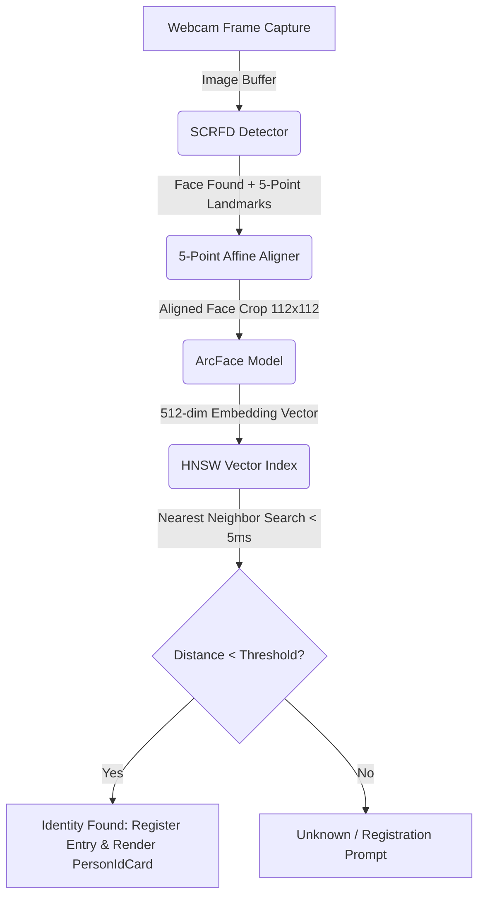
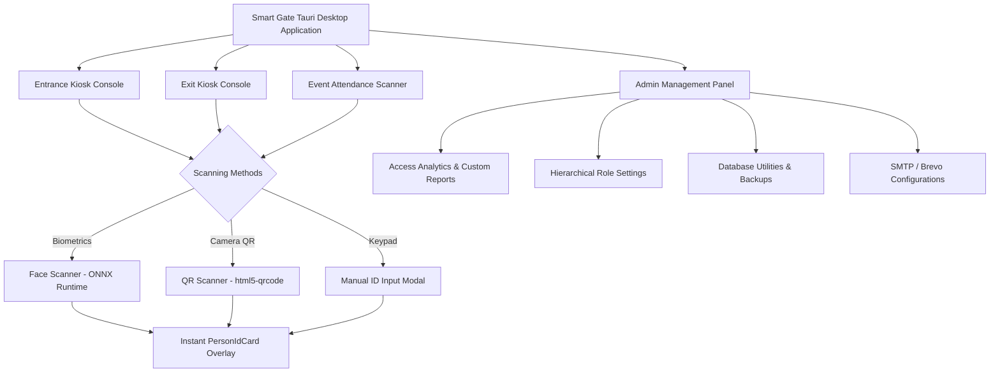

# Smart Gate 🚪🤖

[](https://tauri.app/)
[](https://www.rust-lang.org/)
[](https://react.dev/)
[](https://tailwindcss.com/)
[](https://sqlite.org/)
[](./LICENSE)

An enterprise-grade, high-performance desktop application for campus security, visitor registration, and event attendance tracking. Custom-designed for **Pamantasan ng Lungsod ng Pasig (PLP)**, **Smart Gate** leverages state-of-the-art **Facial Biometrics** (SCRFD + ArcFace run in ONNX Runtime and searched via HNSW graphs in Rust) combined with **QR scanners**, thermal printer integrations, and dynamic administration controls to deliver a seamless kiosk and governance platform.

---

## 🌟 Core System Features

### 1. High-Performance Biometric Face Recognition
*   **Edge Processing**: Performs real-time local face detection and embedding extraction on the user's hardware—no external cloud biometrics API needed.
*   **Dual ONNX Pipeline**:
    *   **SCRFD (det_2.5g.onnx)**: Rapidly detects faces and extracts $5$-point canonical facial landmarks (eyes, nose, mouth corners) even under challenging lighting or angles.
    *   **ArcFace (w600k_r50.onnx)**: Warps aligned crops into $112 \times 112\text{px}$ inputs and extracts precise $512$-dimensional facial embedding vectors.
*   **Sub-Millisecond Matches**: Loads vectors directly into an **HNSW (Hierarchical Navigable Small World)** vector index in Rust, completing similarity searches across thousands of individuals in `< 5ms` ($O(\log n)$ lookup).
*   **Auto-Approve Permissions**: Seamless desktop user experience leveraging custom Tauri handlers that automatically intercept and grant camera access without intrusive browser permissions.

### 2. Multi-Method Scanning & UX
*   **Entrance & Exit Kiosks**: Supports three modes of entry: Face Recognition, Camera-based QR Code scanning, and keyboard/numpad Manual ID input.
*   **Real-time ID Overlays**: Replaces standard notifications with a premium `PersonIdCard` overlay that displays the individual's registered portrait, full name, structural role, and status instantaneously.
*   **Standardized ID Formatting**: centralizes ID inputs to adhere strictly to the PLP format (`00-00000`), with integrated entry validation.

### 3. Visitor Registration & Silent Pass Printing
*   **Dynamic Registration**: Capture a visitor's photo/embedding, assign temporary roles, and specify the purpose and person of interest.
*   **Thermal Printer Integration**: Silently prints professional thermal receipt visitor passes containing entry instructions and QR codes via native printer command endpoints.
*   **Digital Pass Delivery**: Generates custom visitor passes and automatically emails them using the **Brevo API** (SMTP integration) with dynamic HTML layouts.

### 4. Dynamic Roles & Academic Hierarchy
*   **Behavioral Role Inheritance**: Supports main system behaviors (`student`, `employee`, `visitor`) while letting administrators configure custom Sub-Roles (e.g., `professor`, `staff` inheriting from `employee`).
*   **Academic Structure Management**: Integrated dashboards to manage university departments (Colleges like COE, CCS, CE) and academic programs (BSCS, BSIT, BSCE).
*   **Universal Automatic Campus Exit**: A background cron-task checking the database every 60 seconds; automatically registers checkout logs for all users remaining on campus at the configured closing hour.

### 5. Administration & System Governance
*   **Access Logs & Custom Template Builder**: Beautiful analytics dashboard featuring Recharts. Includes a spreadsheet-style Template Builder (inline cell editing, custom columns/rows) to export structured blank attendance sheets or records directly to PDF or Excel.
*   **Field-Level Audit Trails**: Detailed administrative security audit logs tracking every `CREATE`, `UPDATE`, or `DELETE` with exact snapshots showing old vs. new values.
*   **Dynamic Branding & Window Icons**: Change the system name, titles, logos, and the tauri desktop app window icon on the fly. The window icon is updated dynamically on boot by loading and decoding base64 image data stored in the SQLite database.
*   **Robust Database Utilities**: Create, manage, and restore full system backups, purge old records, or retrieve archived database entities easily.

---

## 🏗️ Technical Architecture & Pipeline Flows

### Facial Biometrics Pipeline



### Overall System Interaction Flow



---

## 📁 Repository Structure

```text
Smart_Gate/
├── docs/
│   └── database/
│       └── schema.sql       # Normalized SQLite database schema and seeds
├── frontend/                # React Vite Frontend Application
│   ├── src/
│   │   ├── components/      # UI components (FaceScanner, QRScanner, IdCardProvider)
│   │   │   ├── common/      # Reusable controls (PersonCombobox, AdminModal, AboutModal)
│   │   │   ├── views/       # Administrative sub-panels (AccessLogs, UserManagement)
│   │   │   └── toast/       # Custom toast system
│   │   ├── App.jsx          # Main client router & state provider
│   │   ├── index.css        # Custom styles & Tailwind utilities
│   │   └── main.jsx         # Client entrypoint
│   ├── package.json
│   └── tailwind.config.js
└── src-tauri/               # Rust Backend (Tauri Core)
    ├── capabilities/        # Tauri window permissions and capability rules
    ├── models/              # Destination for SCRFD and ArcFace ONNX models
    ├── src/
    │   ├── face_recognition/# Facial Biometrics Modules
    │   │   ├── alignment.rs # Affine transformation and eye coordinate alignment
    │   │   ├── detector.rs  # SCRFD inference loader
    │   │   ├── pipeline.rs  # Coordinates ONNX runtimes and loads HNSW index
    │   │   └── mod.rs       # Struct definitions & pipeline configurations
    │   ├── commands.rs      # Main Rust handlers invoked by the frontend
    │   ├── db.rs            # SQLite pool manager, database queries, and schema setups
    │   ├── email.rs         # Brevo API integration (Visitor passes & OTPs)
    │   ├── lib.rs           # Bootstrapper, window config, and background auto-exits
    │   ├── main.rs          # App entrypoint
    │   └── models.rs        # Data modeling and serialization mappings
    ├── Cargo.toml           # Backend dependencies (ort, hnsw_rs, rusqlite, calamine)
    └── tauri.conf.json      # Tauri application packaging and settings
```

---

## 🛠️ Tech Stack & Key Libraries

### Backend (Rust)
*   **Tauri v2**: Desktop runtime shell, secure bridging, and native operations.
*   **tauri-plugin-opener v2**: Opens external URLs and `mailto:` links in the system's default browser or mail client.
*   **ONNX Runtime (`ort` v2.0.0-rc.9)**: Accelerated CPU inference for deep neural networks.
*   **HNSW Search (`hnsw_rs` v0.3)**: High-performance vector space indexing for facial embeddings.
*   **SQLite & Connection Pooling (`rusqlite` + `r2d2`)**: Robust local database connection management.
*   **Calamine (`calamine` v0.26)**: Fast parsing of Excel documents during bulk user uploads.
*   **Reqwest**: Secure HTTP client for remote communication with the Brevo API.

### Frontend (React & Styling)
*   **React v19**: Modern declarative UI framework.
*   **Vite**: Ultrafast development bundler.
*   **Tailwind CSS v4.2**: Utility-first responsive design framework.
*   **@tauri-apps/plugin-opener**: JavaScript bridge for triggering OS-level URL and file opens from within the Tauri webview.
*   **Recharts**: Interactive reporting, graphs, and system usage analytics.
*   **html5-qrcode**: Streamlined canvas-based QR reader.
*   **jsPDF & jsPDF-AutoTable**: High-fidelity client-side PDF document layout engine.
*   **Lucide React**: Consistent, minimal icon library used across the UI.

---

## 🚀 Setup & Installation

### 1. Prerequisites
Ensure you have the following installed on your machine:
*   [Rust Up](https://rustup.rs/) (edition 2021, Rust v1.77.2+)
*   [Node.js](https://nodejs.org/) (v18+)
*   C++ Build Tools installed (required for compilation of `ort-sys` and `hnsw_rs` C-bindings).

### 2. Download Face Recognition Models
To utilize biometric face recognition, download the pre-trained model files and place them into the `src-tauri/models/` directory:
1.  **Face Detector**: Download `det_2.5g.onnx` (SCRFD).
2.  **Face Embedder**: Download `w600k_r50.onnx` (ArcFace).

Create the directory and insert the files:
```bash
mkdir src-tauri/models
# Move det_2.5g.onnx and w600k_r50.onnx into src-tauri/models/
```
*Note: If the models are not found, the system will gracefully disable biometric scanning on startup but allow access via QR code and manual credentials.*

### 3. Frontend Installation
Navigate to the frontend directory and install dependencies:
```bash
cd frontend
npm install
```

### 4. Configure Environment Variables
Create a `.env` file in the `src-tauri` directory:
```env
BREVO_API_KEY=your_brevo_api_key_here
```
*Alternatively, you can configure your Brevo API key directly inside the administrative system settings panel.*

### 5. Running the Application
To launch the application in development mode (with hot reloading for both frontend and backend):
```bash
# From the project root or the frontend folder
npm run tauri
```
Tauri will boot up the Vite frontend, compile the Rust backend, link the ONNX model pipelines, build the SQLite databases, and open the fullscreen borderless window.

---

## 🔒 Security & Data Privacy
*   **Local-First Architecture**: Your biometrics stay yours. Facial images are processed in-memory and converted into embeddings. The original images do not leave the computer.
*   **Encryption & Hashing**: Administrative credentials are comprehensively hashed using custom cryptographic algorithms before saving to the database.
*   **Secured APIs**: All SMTP and Brevo communications use SSL, and access tokens are secured in encrypted environment fields or local configs.

---

## 📄 License

This project is licensed under a **Proprietary Academic License**. See the [LICENSE](./LICENSE) file for full terms.

Developed for **Pamantasan ng Lungsod ng Pasig (PLP)**. Unauthorized copying, redistribution, or commercial use of this software or its source code is strictly prohibited without the express written permission of the authors.
